<br>

\[[🇧🇷 Português](README.pt_BR.md)\] \[**[🇺🇸 English](README.md)**\]

<br><br>

#  <p align="center">🧠  AI/ML Project 1 ·  Computer Vision · EMNIST Vision Intelligence</p>

### <p align="center">End-to-End Handwritten Character Recognition System with PyTorch and Streamlit</p>

<br><br>

<!-- ========= END REPO TITLE ========= -->

#### <p align="center">✨ <i>Somewhere between scribbles and intelligence, this model takes shape.</i> ✨</p>

<p align="center">
<b>AI reading handwriting — confidence not guaranteed.</b> ⚡️
</p>

<br>


<br><br>

<!-- ========= START Dashboard Streamlit ========= -->
<p align="center" style="margin: 0;">
  <a href="https://identificados-de-letras-e-numeros.streamlit.app/" rel="noopener noreferrer">
    
  </a>
</p>

<!-- ========= END Dashboard Streamlit ========= -->


<!-- ========= START Canva Slides ========= -->
<p align="center" style="margin: 0;">

  <a href="https://www.canva.com/design/DAHI8GmXZP8/Hxi6FpvjeKvf3em_iXlp2Q/edit" rel="noopener noreferrer">
    
  </a>
  
<!-- =========End Canva Slides ========= -->

<!-- ========= START DATA ANALYSING REPORT ========= -->
  <a href="https://github.com/Mindful-AI-Assistants/ai-ml-emnist-vision-intelligence-pproject/blob/5119adc130f94eff7ef70de7a90ab8d291be764d/Model%20Analysis.pdf" target="_blank" rel="noopener noreferrer">
    
  </a>

</p>

<br><br><br><br>
<!-- ========= END DATA ANALYSING REPORT ========= -->


<!-- ======================================= Institutional INFO =========================================== -->
[**Institution:**]() Pontifical Catholic University of São Paulo (PUC-SP) — FACEI  
[**Course:**]() BSc in Humanistic AI & Data Science — 5th semester — 2026  
[**Subject:**]() Machine Learning for Handwritten Character Recognition  
[**Project:**]() P1 — EMNIST Vision Intelligence Project  

**Professor:** [✨ Rooney Ribeiro Albuquerque Coelho](https://www.linkedin.com/in/rooney-coelho-320857182/)  
**Authors:** [Fabiana ⚡️ Campanari](https://linktr.ee/fabianacampanari) e [✨ Pedro Vyctor Almeida](https://www.linkedin.com/in/pedro-vyctor-almeida-285b89273/) 

<br><br>
<!-- ========= END Institucional INFO ========= -->


<!-- ========= START SPONSORT BADGE ========= -->
#### <p align="center"> [](https://github.com/sponsors/Mindful-AI-Assistants)

<br><br><br>
<!-- ========= END SPONSORTBADGE ========= -->


<!-- =========  START PUC HEADER GIF ========= -->
<p align="center">
   
 </p>


<br><br><br><br>
<!-- =========  END PUC HEADER GIF ========= -->


<!-- ========= START BADGES GROUP 2 ========= -->
<p align="center">
  
</p>

<p align="center">
  
  
</p>

<p align="center">
  
  
  
</p>

<br><br><br>
<!-- ========= END BADGES GROUP 2 ========= -->


<!-- ========= START NOTE ========= -->
> [!WARNING]
>
> ⚠️ Projects may be publicly shared when permitted.  
> The focus is on applied, hands-on learning with real datasets in AI governance and security contexts.  
> All sensitive content remains protected in private repositories when required.
>

<br><br>
<!-- ========= END NOTE ========= -->


<!-- ========= START Main Repo REFERENCE  ========= -->
> [!TIP]
>
> This repository is part of the flagship ecosystem:
>
> ## 🧠 AI & Machine Learning — Main Hub
>
> Explore the complete collection of projects, notebooks, research materials, analyses, and interactive applications available in the central repository:
>
> 🔗 **[AI & Machine Learning — Hub](https://github.com/Mindful-AI-Assistants/1-AI_Machine-Learning_Hub)**
>
> #
>
> ### 🚁 Related Project in this Series
>
> **AI/ML Project 2 · Computer Vision · Helipoint Detector**
>
> Explore the complementary geospatial intelligence system focused on satellite-based helipad detection:
>
> 🔗 [**Helipoint Detector — Computer Vision Project**](https://github.com/Mindful-AI-Assistants/3-project-ai-ml-yolo-helipoint-detector)
>

<br><br><br><br>
<!-- ========= END Main Repo REFERENCE  ========= -->


## Table of Contents

- [Overview](#overview)
- [Objectives](#objectives)
- [Fundamental Concepts](#fundamental-concepts)
- [Dataset Description](#dataset-description)
- [Data Pipeline](#data-pipeline)
- [Neural Network Architecture](#neural-network-architecture)
- [Training Process](#training-process)
- [Model Persistence](#model-persistence)
- [Evaluation and Metrics](#evaluation-and-metrics)
- [MLOps & System Architecture](#mlops-system-architecture)
- [Technologies Used](#technologies-used)
- [Project Structure](#project-structure)
- [Code Examples](#code-examples)
- [How to Run](#how-to-run)
- [Use Cases](#use-cases)
- [Future Improvements](#future-improvements)
- [Conclusion](#conclusion)
- [Bibliographic References](#bibliographic-references)
 

<br><br>

##  [Overview]()

This project presents a complete Deep Learning pipeline focused on handwritten alphanumeric character recognition using the EMNIST Balanced Dataset.

The solution was developed using the PyTorch ecosystem and includes:

- Data ingestion and preprocessing
- Neural network modeling
- Training and validation
- TensorBoard monitoring
- Model persistence
- OpenCV image preprocessing
- Real-time inference
- Probability prediction using Softmax

The project extends beyond a conventional notebook experiment by implementing a production-oriented inference workflow capable of recognizing handwritten digits and letters.

<br><br>

##  [Objectives]()

The main objective of this project is to implement and validate a robust handwritten character recognition pipeline using Artificial Neural Networks.

Specific goals:

- Apply Deep Learning concepts using PyTorch
- Train a Multilayer Perceptron (MLP)
- Explore image preprocessing techniques
- Evaluate multi-class classification performance
- Monitor experiments using TensorBoard
- Build an inference-ready architecture
- Demonstrate model reproducibility and persistence

<br><br>

# 🧠 Fundamental Concepts

## Deep Learning

Deep Learning is a subfield of Machine Learning based on multi-layer Artificial Neural Networks capable of learning complex representations directly from raw data.

Why it matters:

- Automated feature extraction
- Efficient handling of high-dimensional data
- Foundation of modern Computer Vision systems

<br>

## Multilayer Perceptron (MLP)

A Multilayer Perceptron is a fully connected neural architecture composed of dense layers and nonlinear activation functions.

Purpose:

- Learn nonlinear image patterns
- Perform multi-class classification
- Map pixel distributions into semantic labels

<br>

## Optical Character Recognition (OCR)

Optical Character Recognition refers to systems capable of converting handwritten or printed characters into machine-readable representations.

Applications:

- Banking automation
- Document digitization
- Postal systems
- Educational technologies

<br><br>

## 🗂️ Dataset Description

The project uses the EMNIST Balanced Dataset, an extension of the classic MNIST dataset.

| Property | Value |
|---|---|
| Classes | 47 |
| Image Size | 28×28 |
| Color Space | Grayscale |
| Content | Digits + Uppercase + Lowercase |

The dataset includes:

- Digits from 0–9
- Uppercase letters
- Selected lowercase letters

The EMNIST Balanced variation was selected because it presents a significantly more realistic classification scenario than traditional MNIST.

<br><br>

# 🔄 Data Pipeline

## Pipeline Stages

```text
Dataset Loading
↓
Transforms
↓
Normalization
↓
Data Splitting
↓
DataLoader
↓
Training
↓
Validation
↓
Testing
```

<br>

## Normalization

The normalization procedure used:

$$x' = \frac{x - \mu}{\sigma}$$

Where:

- $\mu = 0.2860$
- $\sigma = 0.3530$

Normalization stabilizes gradient propagation and accelerates convergence.

<br><br>

# 🏗️ Neural Network Architecture

## Architecture Overview

The implemented model is a fully connected Multilayer Perceptron named:

```python
MLP_EMNIST
```

<br>

## Model Topology

```text
Input (28x28)
↓
Flatten
↓
Linear 784 → 512
↓
ReLU
↓
Dropout 0.3
↓
Linear 512 → 256
↓
ReLU
↓
Dropout 0.2
↓
Linear 256 → 128
↓
ReLU
↓
Linear 128 → 47
↓
Softmax
```

<br>

## PyTorch Model

```python
class MLP_EMNIST(nn.Module):
    def __init__(self, n_classes: int = 47):
        super().__init__()

        self.linear_relu_stack = nn.Sequential(
            nn.Flatten(),
            nn.Linear(28*28, 512),
            nn.ReLU(),
            nn.Dropout(0.3),

            nn.Linear(512, 256),
            nn.ReLU(),
            nn.Dropout(0.2),

            nn.Linear(256, 128),
            nn.ReLU(),

            nn.Linear(128, n_classes)
        )
```

<br>

## ReLU Activation

$$ReLU(x) = max(0, x)$$

Benefits:

- Faster convergence
- Reduced vanishing gradients
- Computational efficiency

<br><br>

# ⚙️ Training Process

| Parameter | Value |
|---|---|
| Batch Size | 128 |
| Framework | PyTorch |
| Dataset | EMNIST Balanced |
| Device | CPU / GPU (CUDA) |

<br>

## Loss Function

The model uses:

$$CrossEntropyLoss$$

This function is appropriate for multi-class classification problems.

<br>

## TensorBoard Monitoring

TensorBoard was used to monitor:

- Loss curves
- Accuracy curves
- Validation performance
- Experiment progression

Benefits:

- Better debugging
- Easier hyperparameter tuning
- Improved experiment analysis

<br><br>

# 💾 Model Persistence

## Checkpoint Saving

```python
torch.save()
```

<br>

## Model Loading

```python
checkpoint = torch.load("best_model.pth")
model.load_state_dict(checkpoint['modelo_state'])
```

Why persistence matters:

- Reproducibility
- Deployment readiness
- Experiment continuation
- Production inference

<br><br>

##  [Evaluation and Metrics]()

## Accuracy

$$Accuracy = \frac{TP + TN}{TP + TN + FP + FN}$$

<br>

## Confusion Matrix

The confusion matrix highlights:

- Correct predictions
- Misclassifications
- Class ambiguities

Examples of difficult distinctions:

- '1' vs 'l'
- '9' vs 'q'

<br><br>


<br><br>


## [MLOps & System Architecture][()

```mermaid
%%{init: {
  "theme": "base",
  "themeVariables": {
    "background": "#020617",
    "primaryColor": "#020617",
    "primaryBorderColor": "#2dd4bf",
    "primaryTextColor": "#ffffff",
    "lineColor": "#2dd4bf",
    "secondaryColor": "#020617",
    "tertiaryColor": "#020617",
    "clusterBkg": "#020617",
    "clusterBorder": "#2dd4bf",
    "fontFamily": "Inter, monospace",
    "fontSize": "16px"
  }
}}%%

flowchart TB

%% =========================
%% STYLE
%% =========================
classDef clean fill:#020617,stroke:#2dd4bf,color:#ffffff,stroke-width:1px;

%% =========================
%% PIPELINE
%% =========================

A["EMNIST Balanced Dataset"]:::clean

B["Handwritten Character Samples"]:::clean

C["Image Preprocessing"]:::clean

D["Grayscale Conversion"]:::clean

E["Resize to 28×28"]:::clean

F["Tensor Transformation"]:::clean

G["Python AI Pipeline"]:::clean

H["PyTorch Deep Learning Model"]:::clean

I["Perceptron Layers"]:::clean

J["Convolutional Neural Networks"]:::clean

K["Dropout Regularization"]:::clean

L["Backpropagation & Optimization"]:::clean

M["TensorBoard Monitoring"]:::clean

N["Accuracy & Loss Evaluation"]:::clean

O["OpenCV Real-Time Processing"]:::clean

P["Character Prediction Engine"]:::clean

Q["Softmax Probability Output"]:::clean

R["Streamlit Interactive Dashboard"]:::clean

S["Drawing Canvas Interface"]:::clean

T["Final AI Inference"]:::clean

%% =========================
%% FLOW
%% =========================

A --> B
B --> C
C --> D
D --> E
E --> F
F --> G

G --> H
H --> I
I --> J
J --> K
K --> L

L --> M
M --> N

N --> O
O --> P
P --> Q

Q --> R
R --> S
S --> T

linkStyle default stroke:#2dd4bf,stroke-width:1px;
```


<br><br>





<br><br>

# 🛠️ Technologies Used

| Technology | Purpose |
|---|---|
| PyTorch | Deep Learning framework |
| OpenCV | Image preprocessing |
| TensorBoard | Experiment monitoring |
| NumPy | Numerical operations |
| PIL | Image manipulation |
| CUDA | GPU acceleration |
| scikit-learn | Evaluation metrics |

<br><br>

# 📁 Project Structure

```text
project/
│
├── data/
├── notebooks/
│   └── Neural_Network.ipynb
│
├── backup_models/
│   └── best_model.pth
│
├── runs/
│   └── tensorboard_logs/
│
├── main.py
├── MLP_EMNIST.py
├── requirements.txt
└── README.md
```

<br><br>

# 💻 Code Examples

## Image Preprocessing

```python
img = cv2.cvtColor(img.astype(np.uint8), cv2.COLOR_RGBA2GRAY)
img = 255 - img
_, img = cv2.threshold(img, 50, 255, cv2.THRESH_BINARY)
```

<br>

## Softmax Prediction

```python
probabilities = torch.nn.functional.softmax(output, dim=1)
confidence, pred_idx = torch.max(probabilities, 1)
```

<br>

## Device Selection

```python
device = torch.device('cuda' if torch.cuda.is_available() else 'cpu')
```

<br><br>

# ▶️ How to Run

## Clone Repository

```bash
git clone https://github.com/your-repository/emnist-vision-intelligence.git
```

<br>

## Install Dependencies

```bash
pip install -r requirements.txt
```

<br>

## Run Project

```bash
python main.py
```

<br><br>

# 🎯 Use Cases

Potential real-world applications:

- OCR systems
- Banking automation
- Educational AI tools
- Smart document analysis
- Accessibility technologies

<br><br>

# 🚀 Future Improvements

Possible future extensions:

- Convolutional Neural Networks (CNNs)
- Transformer architectures
- Real-time webcam inference
- Cloud deployment
- Explainable AI (XAI)
- Docker containerization

<br><br>

# ✅ Conclusion

This project successfully demonstrates the complete lifecycle of a modern Deep Learning solution, from raw data ingestion to inference-ready deployment.

The implementation consolidated practical knowledge involving:

- Neural Networks
- Image preprocessing
- Model persistence
- Real-time inference
- Computer Vision
- Deep Learning experimentation

The integration between PyTorch, OpenCV, TensorBoard, and EMNIST transformed an academic assignment into a sophisticated applied Artificial Intelligence solution.

<br><br>

# 📖 Bibliographic References

- PyTorch Documentation
- EMNIST Dataset Paper
- TensorBoard Documentation
- OpenCV Documentation
- scikit-learn Documentation

<br><br>

# ⭐ Academic Contribution

This repository demonstrates practical applications of:

- Deep Learning
- Computer Vision
- Neural Networks
- OCR systems
- Experiment tracking
- MLOps concepts

The project combines academic research methodology with production-oriented engineering practices.

<br><br>

<!-- ========= END README ========= -->


<!-- ======================================= Start DEFAULT Footer ===========================================  -->
## 💌 [Let the data flow... Ping Me !](mailto:fabicampanari@proton.me)

<br>


#### <p align="center">  🛸๋ My Contacts [Hub](https://linktr.ee/fabianacampanari)


<br>

### <p align="center"> 


<br><br>

<p align="center">  ────────────── ⊹🔭๋ ──────────────

<!--
<p align="center">  ────────────── 🛸๋*ੈ✩* 🔭*ੈ₊ ──────────────
-->

<br>

<p align="center"> ➣➢➤ <a href="#top">Back to Top </a>
  

  
#
 
##### <p align="center">Copyright 2026 Mindful-AI-Assistants. Code released under the  [MIT license.](https://github.com/Mindful-AI-Assistants/CDIA-Entrepreneurship-Soft-Skills-PUC-SP/blob/21961c2693169d461c6e05900e3d25e28a292297/LICENSE)


<!-- ======================================= End  DEFAULT Footer ===========================================  -->


